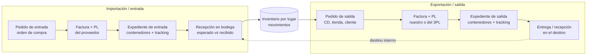
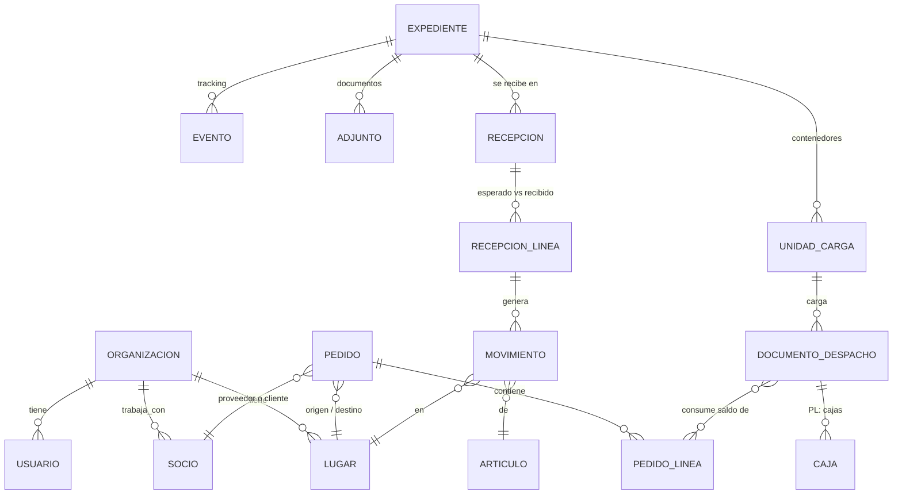
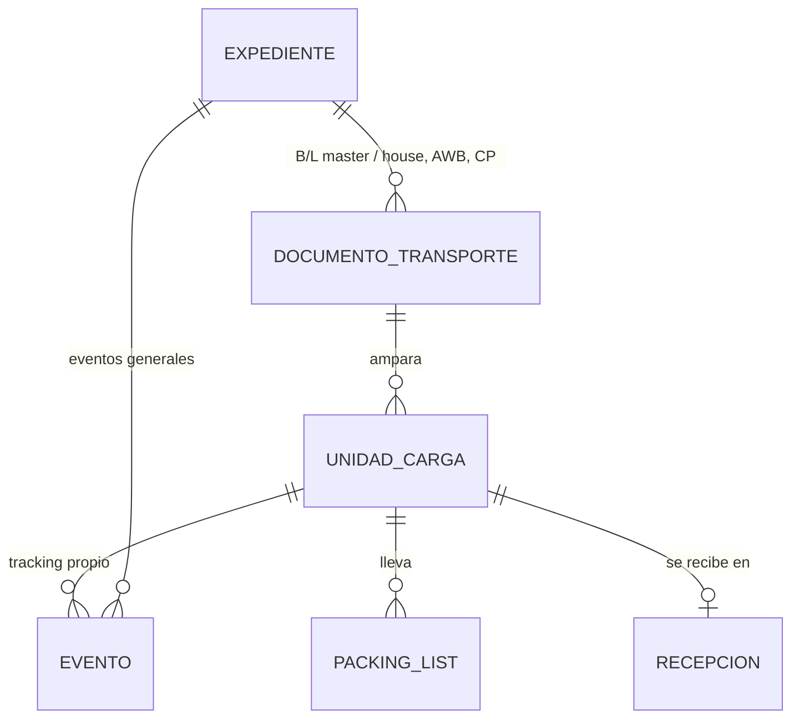

# Diseño: operación genérica de comercio exterior (importación, inventario y salidas)

Continúa `docs/analisis_plataforma_generica.md` con las decisiones tomadas:

| Decisión | Respuesta |
|---|---|
| Empresas | **Varias empresas en una misma instalación** |
| PL de exportación | Lo hacemos **nosotros o el operador logístico** |
| Accesos | **No es delegación**: un líder crea usuarios **debajo de él**, con lo mismo o menos que él tiene |
| Edición simultánea | Se avisa quién está editando y **los demás entran solo en modo lectura** |
| Nuevo | Disposiciones de tablas por rol y usuario, columnas permitidas por rol, campos personalizados con reglas, pasos en vez de modales, expediente por embarque, recepciones con diferencias, inventario, pedidos de salida y exportación |

El objetivo es cubrir **toda la operación** con **pocas piezas que se
repiten**: desde la orden de compra, su tracking y la carga en contenedores,
hasta la recepción en bodega, el inventario con sus diferencias y el despacho
a un centro de distribución, una tienda, un cliente externo o uno interno.

---

## 1. La idea central: 6 piezas que se repiten

En lugar de una tabla y una pantalla distintas para cada caso, todo el sistema
se arma con seis piezas:

| # | Pieza | Qué es | Ejemplos |
|---|---|---|---|
| 1 | **Lugar** | Dónde está o a dónde va la mercancía | Bodega fiscal, CD, tienda, planta, puerto, bodega del cliente |
| 2 | **Socio** | Con quién se trabaja | Proveedor, cliente, operador logístico (3PL), forwarder, agente aduanal, transportista |
| 3 | **Pedido** | Lo que se pide que se mueva, con sus líneas y su saldo | **Entrada**: orden de compra. **Salida**: pedido a CD, tienda o cliente |
| 4 | **Documento de despacho** | Lo que acompaña físicamente a la mercancía | Factura comercial, packing list (cajas, peso, volumen) |
| 5 | **Expediente** | El embarque y todo lo que lo rodea | Contenedores, tracking, documentos (B/L, DUA, certificados), recepción o entrega |
| 6 | **Movimiento de inventario** | Lo que entró o salió de un lugar | Entrada por recepción, salida por despacho, ajuste, traslado |

Toda la operación es la misma cadena en las dos direcciones:

Si el destino de una salida es un lugar propio (un CD o una tienda de la misma
empresa), su llegada **crea sola la recepción esperada** en ese lugar. Un
traslado entre países es una salida en un lugar y una entrada en otro, con un
solo expediente.

### Cómo se relaciona cada cosa

---

## 2. Cada pieza en detalle

### 2.1 Organización, lugares y socios

- **Organización**: es la empresa. Todo registro lleva `organizacion_id` y el
  servidor filtra siempre por ella. Cada una tiene su configuración: nombre,
  logo, idioma, moneda, formatos, numeraciones, términos, módulos activos,
  campos personalizados y disposiciones.
- **Lugar**: reemplaza a centro, almacén y bodega.
  - Tipos: `BODEGA`, `BODEGA_FISCAL`, `CD`, `TIENDA`, `PLANTA`, `PUERTO`,
    `EXTERNO`.
  - Pertenece a una **entidad legal** (la sociedad de hoy).
  - Puede tener **ubicaciones** internas (pasillo y rack) de forma opcional.
  - Un lugar externo es la dirección de un socio.
- **Socio**: una sola tabla con uno o más roles: proveedor, cliente, 3PL,
  forwarder, agente aduanal o transportista.
  - Proveedor y Transportista migran aquí.
  - Un socio puede tener **usuarios propios**: el portal de proveedor de hoy
    pasa a ser un portal de socio. Así el 3PL arma los PL de salida y el
    forwarder carga eventos.

### 2.2 Pedido (entrada o salida)

Una sola estructura para los dos sentidos:

| Campo | Entrada (orden de compra) | Salida (pedido) |
|---|---|---|
| `sentido` | `ENTRADA` | `SALIDA` |
| Socio | Proveedor | Cliente (o ninguno si es interno) |
| Origen | País o puerto del proveedor | Lugar propio que despacha |
| Destino | Lugar propio | CD, tienda, cliente externo o lugar de otra entidad propia |
| Líneas | Artículo, cantidad, unidad, precio, fechas | Igual |
| Saldo | Cantidad pedida − facturada o despachada | Igual |
| Estado | Borrador → Liberado → Parcial → Completo → Cerrado | Igual |

- La **liberación** es un estado propio (`PENDIENTE`, `LIBERADO`, `BLOQUEADO`).
  Los códigos del ERP del cliente (SAP `300`, `301`, `304`, `C`, `P`) se
  traducen con una tabla de equivalencias por organización.
- Las fechas clave tienen **nombre configurable**: "Lista para despacho" (hoy
  XF) y "Requerida en destino" (hoy fecha en tienda). Con ellas se calculan
  igual el riesgo y la holgura.
- Se cargan **a mano (con pasos)** o **por plantilla**. La plantilla se genera
  sola desde los campos configurados (sección 4).

### 2.3 Documento de despacho: factura y packing list

Es lo que hoy existe, sin cambios en la lógica de saldo, versiones, cajas,
plantillas de empaque, PDF y Excel. Solo cambia esto:

- `emisor` y `receptor`. En entrada emite el proveedor y recibimos nosotros.
  En salida emitimos nosotros y recibe el cliente o el lugar destino.
- **Quién arma el PL**: un usuario interno o un usuario del 3PL. El permiso
  `pl.editar` se da a cualquiera de los dos, siempre dentro de su alcance.
- Los PDF toman emisor y receptor del documento.

### 2.4 Expediente

El **embarque pasa a ser el expediente**: una sola página con todo lo de esa
operación.

| Pestaña | Contenido |
|---|---|
| Resumen | Ruta, fechas (ETD, ETA, límite, requerida), estado vs. plazo, cifras |
| Contenido | Contenedores o unidades de carga, los PL y facturas que lleva cada una, llenado |
| Tracking | Hitos y eventos; quién los registró; visibilidad por participante |
| Documentos | B/L o AWB, declaración aduanera, certificados, fotos, con tipos configurables y requisitos por paso |
| Participantes | Proveedor o cliente, forwarder, agente, transportista y lo que cada uno ve |
| Recepción / Entrega | La recepción en el lugar destino (entrada) o la entrega al cliente (salida) |
| Diferencias | Esperado vs. recibido por artículo y por caja |
| Actividad | Historial completo |

Cada expediente tiene `sentido` (`ENTRADA` o `SALIDA`), origen y destino.

### 2.5 Recepción y diferencias

1. Cuando el expediente llega, se crea la **recepción esperada**: las líneas
   salen de los PL del expediente, por artículo y opcionalmente por caja.
2. La bodega registra lo recibido de tres formas:
   - **a mano**, con una pantalla de conteo rápido (buscar o escanear el
     código y escribir la cantidad);
   - **por plantilla** (Excel o CSV con mapeo de columnas);
   - **"todo conforme"**, un clic cuando no hay novedades.
3. El sistema calcula las **diferencias** por línea: faltante, sobrante,
   dañado y no esperado (artículo que no venía en el PL), con motivo y
   foto opcional.
4. Al **confirmar** la recepción:
   - se generan los movimientos de inventario: lo bueno a disponible y lo
     dañado a "retenido", si la organización lo usa;
   - se emite el **reporte de ingreso** en PDF y Excel, con las diferencias;
   - los faltantes quedan como reclamo abierto ante el proveedor o la
     aseguradora.
5. La recepción admite **parciales**: varios conteos hasta cerrar.

### 2.6 Inventario (sencillo)

- El inventario es un **libro de movimientos**: lugar, ubicación opcional,
  artículo, lote o serie opcional, cantidad con signo, estado del stock y
  documento de origen. El saldo es la suma.
- Estados de stock: **disponible**, **reservado** (comprometido en un pedido
  de salida), **retenido** (dañado o en revisión) y **en tránsito** (en un
  expediente de salida hacia un lugar propio).
- Funciones:
  - existencias por lugar y artículo;
  - kardex (historial de movimientos);
  - ajustes con motivo y permiso;
  - traslados entre lugares;
  - conteo físico simple: subir el conteo y ver la diferencia contra el
    sistema.
- Fuera de alcance (sección 8): costeo, valuación contable y reabastecimiento
  automático.

### 2.7 Salidas y exportación

1. **Pedido de salida**: a mano con pasos, o por plantilla. El destino puede
   ser un CD, una tienda, un cliente externo o un lugar de otra entidad
   propia.
2. **Reserva**: el sistema reserva el disponible del lugar origen y avisa
   qué no alcanza.
3. **Packing list**: lo arma nuestro equipo o el usuario del 3PL, con las
   mismas plantillas de empaque que en la entrada.
4. **Factura comercial** de exportación, cuando el destino está en otro país
   o es otra entidad legal.
5. **Expediente de salida**: contenedores, documentos de exportación y
   tracking compartido con el cliente.
6. **Entrega**:
   - Destino propio: se crea la recepción esperada en el destino (sección 2.5).
   - Destino externo: se registra la entrega o la prueba de entrega, con
     diferencias reportadas por el cliente.
   - En los dos casos sale el movimiento de inventario del origen.

---

## 3. Usuarios, roles y accesos

### 3.1 Usuarios bajo un líder (jerarquía)

- Cada usuario puede tener un **líder** (`lider_id`). Esto forma un árbol por
  organización y por socio.
- Un usuario con el permiso `usuarios.equipo` puede **crear, editar,
  desactivar y reiniciar la contraseña** de los usuarios **debajo de él**
  (directos e indirectos).
- **Nunca puede dar más de lo que tiene**:
  - los roles que asigna deben tener **solo permisos que él tiene**;
  - el alcance (lugares, entidades, marcas, socios) debe estar **dentro del
    suyo**;
  - las columnas que permite ver o editar deben estar **dentro de las suyas**.
- Si al líder le quitan algo, el servidor lo **recorta** a todo su equipo en
  el siguiente acceso. Se calcula siempre, sin copiar permisos.
- Un usuario de un socio (por ejemplo el jefe de bodega del 3PL) arma su
  propio equipo sin pedirle nada a la empresa.
- Un administrador de la organización ve y gestiona todo el árbol.

### 3.2 Rol, alcance y columnas

| Pieza | Define | Ejemplo |
|---|---|---|
| Permiso | Una acción | `pedido.crear`, `recepcion.confirmar`, `inventario.ajustar` |
| Rol | Conjunto de permisos **y de columnas por tabla** (ver o editar) | "Bodega": recepciones e inventario; en Pedidos no ve precios |
| Alcance | Qué registros | Lugares 8010 y 8020, socio "Vans", entidad legal SV |

- **Columnas por rol**: para cada tabla o entidad se marcan las columnas
  visibles y las editables. El **servidor no envía** las columnas no
  permitidas: tampoco salen en exportes, PDF ni búsqueda. No es solo ocultar
  en pantalla.
- Una sola función en el servidor, `puede(usuario, acción, registro, campo)`,
  decide todo. Así no hay reglas sueltas en cada pantalla.

### 3.3 Varias empresas

- Un usuario pertenece a una organización. Los usuarios de socios que
  trabajan con varias empresas (forwarders, 3PL) pueden tener **membresías**
  en varias y cambian de empresa con un selector, sin mezclar datos.
- Los códigos (pedido, artículo, socio, expediente) son únicos **dentro de la
  organización**.

---

## 4. Campos personalizados con reglas

Cada organización decide, por **sección** (pedido, línea de pedido, factura,
PL, caja, expediente, contenedor, recepción, línea de recepción, artículo y
socio), qué campos usa.

**Definición de campo**

| Atributo | Opciones |
|---|---|
| Tipo | Texto, número, decimal, fecha, sí/no, lista, lista múltiple, socio, lugar, archivo |
| Origen | **Estándar** (del sistema; se puede ocultar u obligar) o **personalizado** (nuevo) |
| Reglas | Obligatorio (siempre o **cuando** se cumple una condición, p. ej. "si destino = exportación"); valor por defecto; mínimo y máximo; formato; lista de valores |
| Momento | En qué estado o paso se pide, y desde cuál ya no se puede cambiar (p. ej. "obligatorio al finalizar") |
| Quién | Roles que lo ven y roles que lo editan (se integra con columnas por rol) |
| Dónde aparece | Formulario y pasos, tabla (columna y filtro), plantilla de carga, PDF y Excel |

- Las condiciones usan el **mismo validador de condiciones** que ya usa el
  motor de clasificación y los lead times (`{campo, operador, valor}`).
- Los valores se guardan en una columna `extra` (JSON) por entidad. No se
  crean columnas nuevas en la base.
- **Las plantillas de carga se generan solas** desde la definición: si una
  empresa agrega "Número de booking" al expediente, aparece en el formulario,
  en la tabla, en el filtro, en la plantilla y en el reporte.

---

## 5. Disposiciones de tablas (columnas y filtros)

Una **disposición** guarda, para una tabla, las columnas (cuáles, orden y
ancho), los filtros, el orden y la agrupación.

| Nivel | Quién la define | Qué hace |
|---|---|---|
| Organización | Administrador | Disposición base para todos |
| Rol | Administrador o líder | **Columnas permitidas** (límite duro) y **disposiciones predeterminadas** (p. ej. "Bodega: pendientes de recibir en mi lugar") |
| Usuario | Cada persona | Sus vistas guardadas (ya existen); solo puede elegir **entre las columnas que su rol permite** |

- Al entrar a una tabla se aplica la predeterminada del usuario, si no la del
  rol y si no la de la organización.
- Las disposiciones de rol pueden venir con **filtros ya cargados** y
  **fijos**. Un fijo es, por ejemplo, "solo mi lugar": el usuario no lo puede
  quitar.
- Un **selector de columnas** en cada tabla permite mostrar u ocultar,
  reordenar y "Guardar como vista".
- El exporte a Excel respeta la disposición activa.

---

## 6. Patrones de pantalla: cuándo usar cada uno

| Patrón | Cuándo | Ejemplos |
|---|---|---|
| **Página con pasos** | Crear algo con varias partes o que la persona debe entender en orden | Nuevo pedido (datos → líneas → revisar), Nuevo PL (factura → cajas → revisar), Nuevo expediente (ruta → contenedores → documentos), Recepción (esperado → conteo → diferencias → confirmar), Importar archivo (subir → mapear → vista previa → confirmar) |
| **Página de trabajo** | Trabajar un documento existente | Pedido, factura, PL y expediente con pestañas |
| **Panel lateral** | Consultar o editar algo puntual **sin perder la lista** | Resumen de factura o expediente (ya existe), editar fechas de una línea, ver un artículo |
| **Modal** | Solo cambios **rápidos** (1 a 3 campos) o confirmaciones | Reabrir con motivo, cambiar ETA, confirmar borrado, asignar a contenedor |
| **Edición en la tabla** | Muchas filas con un mismo dato | Cantidades en conteo de recepción, fechas en líneas de pedido |

Reglas de los pasos:
- Se ve siempre en qué paso se está y qué falta (el componente de requisitos
  ya existe).
- Se guarda como borrador en cada paso: si la persona sale, retoma donde iba.
- El último paso siempre muestra un resumen antes de confirmar.

---

## 7. Edición: uno edita, los demás leen

1. Al pulsar **Editar** en un documento (pedido, factura, PL, expediente,
   recepción o artículo), el servidor entrega un **permiso de edición**
   exclusivo. Se guarda en la tabla `edicion` (entidad, id, usuario, desde,
   vence).
2. Mientras la pantalla esté abierta se renueva cada 30 s. Si se cierra la
   pestaña o se pierde conexión, **vence solo a los 2 minutos**.
3. Quien entra mientras tanto ve: *"María López está editando este documento
   desde las 10:42"*. La pantalla queda **solo en modo lectura** y se
   actualiza cuando María guarda o sale.
4. El servidor **rechaza** cualquier cambio de quien no tiene el permiso de
   edición. No depende de la pantalla.
5. Un administrador (o el líder de María) puede **liberarlo**; queda en el
   historial.
6. Como red de seguridad se mantiene el control de `version` en todo lo
   editable. Así ni una integración ni una carga masiva pisan cambios.
7. Las operaciones que consumen saldo (facturar contra un pedido, reservar
   inventario, confirmar una recepción) se hacen con **bloqueo de fila** en
   la base. Producción va en PostgreSQL.

---

## 8. Qué no se construye (para mantenerlo liviano)

- Contabilidad, cuentas por pagar o cobrar, costeo y valuación de inventario.
- MRP o reabastecimiento automático, producción, CRM, listas de precios y
  nómina.
- Un WMS completo (oleadas de picking, radiofrecuencia avanzada). Quedan las
  ubicaciones opcionales y el conteo simple.

Para todo eso, **se integra**: importar pedidos y maestros y exportar
recepciones, despachos y movimientos con el importador por mapeo y la tabla
de equivalencias de códigos.

---

## 9. Qué se reutiliza de lo que ya existe

| Hoy | Pasa a ser |
|---|---|
| `OrdenCompra` + `PosicionOC` | `Pedido` (sentido `ENTRADA`) + `PedidoLinea` |
| `Factura`, `PackingList`, cajas, plantillas de empaque | Documento de despacho, igual, con emisor y receptor |
| `Embarque` + `UnidadCarga` + `EventoEmbarque` | Expediente + unidad de carga + evento, con sentido y participantes |
| `RecepcionLinea` | Recepción + línea con esperado, recibido y diferencias |
| `Proveedor`, `Transportista` | `Socio` con roles |
| `Sociedad`, `Centro`, `Almacen` | Entidad legal y `Lugar` (con ubicaciones) |
| `Rol` + `Usuario.rol` + `proveedor_id` | Rol (permisos y columnas) + alcance + líder |
| Vistas guardadas (`preferencias.vistas`) | Disposiciones de usuario, más las de rol y organización |
| Motor de condiciones (clasificación y lead times) | Reglas de campos personalizados |
| Requisitos para continuar, panel lateral, búsqueda global | Igual, en todas las piezas nuevas |
| Lead times, riesgo vs. fecha requerida | Igual, con nombres de fecha configurables |
| Clasificación arancelaria | **Módulo opcional** por organización |

Las tablas se migran con datos. Durante la transición, la API acepta los
nombres viejos (`codigo_sap`, `liberacion_logistica`) como alias.

---

## 10. Etapas

Cada etapa deja algo usable, se publica sola, con migración y pruebas, y sin
quitar lo que funciona.

| Etapa | Contenido | Se puede usar para |
|---|---|---|
| **E1. Bases** | Organización (multiempresa), `organizacion_id` y unicidad por empresa, configuración desde la app, **edición exclusiva con modo lectura**, `version` en todo | Varias empresas; nadie pisa a nadie |
| **E2. Accesos** | Permisos, roles con **columnas por tabla**, alcance, **líder y equipo**, función `puede()` | Que cada líder arme su equipo; ocultar precios a bodega |
| **E3. Configurable** | **Campos personalizados con reglas**, **disposiciones** (organización, rol y usuario) con selector de columnas, términos y equivalencias de códigos (sin SAP) | Que cada empresa use solo lo que necesita |
| **E4. Lugares y socios** | `Lugar`, entidad legal y `Socio` con roles; portal de socio (3PL, forwarder) | Base de entradas y salidas |
| **E5. Expediente y recepción** | Expediente con pestañas, documentos, **recepción con diferencias**, reporte de ingreso, **inventario** (movimientos, existencias, kardex, ajustes) | Cerrar la importación hasta la bodega |
| **E6. Salidas** | **Pedido de salida** (a mano y por plantilla), reserva, PL por nosotros o el 3PL, factura de exportación, expediente de salida, entrega y recepción en destino propio | Despachos a CD, tienda, cliente y exportación |
| **E7. Tracking compartido** | Participantes, visibilidad por evento, hitos por sentido y modo, avisos | Que proveedor, cliente y forwarder vean lo suyo |
| **E8. Pasos e importador** | Pasar a **páginas con pasos** los "nuevo ..." y la recepción, **importador universal con mapeo** y plantillas generadas por la definición | Más fácil de aprender; cargar cualquier archivo |

Orden: E1 y E2 primero, porque son la base de seguridad y no cambian
pantallas de negocio. E3 hace al sistema genérico. Después E4 → E5 → E6
completan la operación, y E7 y E8 la pulen. La E8 puede adelantarse por
partes: cada pantalla nueva de E5 y E6 ya nace con pasos.

---

## 11. Decisiones confirmadas

1. **Inventario solo por cantidad**, sin costo. Lote o serie quedan para
   después.
2. **Recepciones parciales permitidas**, y **el contenedor es la unidad de
   seguimiento** (sección 12).
3. **Lo dañado queda como "retenido"** en el inventario, no se descarta.
4. **El selector de empresa** solo aparece para quien pertenece a más de una.
5. **El modo lectura aplica a los documentos**; los catálogos usan solo el
   control de versión.
6. **Varias bodegas con inventario separado**, y en cada recepción **se
   elige a qué bodega o bodega fiscal llega** la mercancía (sección 13).

---

## 12. El contenedor como unidad de seguimiento

Un documento de transporte (B/L, AWB o carta de porte) puede traer varios
contenedores, y cada uno puede seguir un camino distinto. Ejemplo: un B/L con
4 contenedores en el que aduana libera 2 y retiene 2. Los 2 liberados se
entregan; los otros esperan.

**Estructura**

**Reglas**

- Cada **unidad de carga** (contenedor, pallet aéreo, camión) tiene su
  propio estado, su ETA y su fecha de llegada real, su estado aduanero
  (`PENDIENTE`, `EN_REVISION`, `RETENIDO`, `LIBERADO`), su entrega y su
  recepción.
- Un **evento** se registra para el expediente completo (se aplica a todas
  sus unidades, p. ej. "Zarpó") o para **unidades específicas** (p. ej.
  "Contenedores 3 y 4 retenidos por aduana", "Contenedor 1 entregado en
  bodega").
- El **estado del expediente se calcula** de sus unidades: "2 de 4
  liberados", "1 de 4 recibido". La ETA del expediente es la más próxima de
  sus unidades pendientes. El riesgo contra la fecha requerida se calcula
  **por unidad** y el expediente muestra el peor caso.
- Los **hitos configurables** (sección 2.4) se aplican por unidad; el
  tablero de tracking puede verse por expediente o por contenedor.
- La **recepción se hace por unidad** o por un grupo de unidades: los
  liberados se reciben hoy y los retenidos cuando se liberen. Cada recepción
  descuenta lo esperado solo de los PL que van en sus unidades.
- Este mismo modelo sirve para la salida: un despacho de 3 camiones a 3
  tiendas es un expediente con 3 unidades, cada una con su destino, su
  tracking y su entrega.

---

## 13. Varias bodegas e inventario separado

- Cada **lugar de tipo bodega** (bodega, bodega fiscal, CD o tienda) tiene
  su **propio inventario**. Las existencias, el kardex, los ajustes y los
  conteos son por lugar y opcionalmente por ubicación.
- **Destino al recibir**: el expediente propone la bodega destino (la del
  pedido), pero en cada recepción **se elige la bodega real**. Así cada
  contenedor puede ir a una bodega distinta, por ejemplo 2 a la bodega
  fiscal A y 2 a la bodega B.
- **Bodega fiscal**: la mercancía queda con **estado aduanero "bajo control
  aduanero"** (no nacionalizada).
  - Para pasarla a una bodega normal se hace un **traslado de
    nacionalización** con la referencia de la declaración aduanera.
  - Ese traslado es una salida de la bodega fiscal y una entrada en la
    nacional, con su documento.
  - Una salida de exportación puede despacharse **directo desde la bodega
    fiscal** (reexportación) sin nacionalizar.
- **Traslados entre bodegas**: son un pedido de salida con destino propio.
  Se usa el mismo flujo (PL opcional, unidad de carga y recepción en
  destino) y la mercancía figura "en tránsito" mientras viaja.
- **Accesos por bodega**: el alcance de un usuario puede limitarse a una o
  varias bodegas. Así el personal de cada bodega ve y mueve solo su
  inventario (sección 3.2).

---

## 14. Avance

| Etapa | Estado | Notas |
|---|---|---|
| E1a. Edición exclusiva | **Hecha** | Tabla `ediciones`; verificación central al guardar (documento y sus partes); aviso y modo lectura en factura, PL, embarque y producto; vence a los 2 min sin conexión y a los 10 min sin uso; un administrador puede liberarla |
| E1b. Varias empresas | **Hecha** | Tabla `organizaciones`; `organizacion_id` en 43 tablas de negocio; filtro central en todas las consultas; códigos únicos por empresa; reglas y preferencias por empresa (pantalla *Company*); quien administra la plataforma crea empresas y entra a cualquiera (pantalla *Companies*) |

**Datos compartidos entre empresas** (no llevan `organizacion_id`): el arancel
oficial (fuentes, versiones, árbol, notas, códigos nacionales, impuestos), el
catálogo del motor de clasificación, países y puertos. Son datos de
referencia de la plataforma. Lo que cada empresa decide sobre ellos
(clasificaciones, ajustes propios) sí es de la empresa.

**Pendiente para E2**: un usuario en varias empresas con su propio rol en
cada una (membresías y selector de empresa), junto con el rol, el alcance, el
líder y las columnas por rol.
